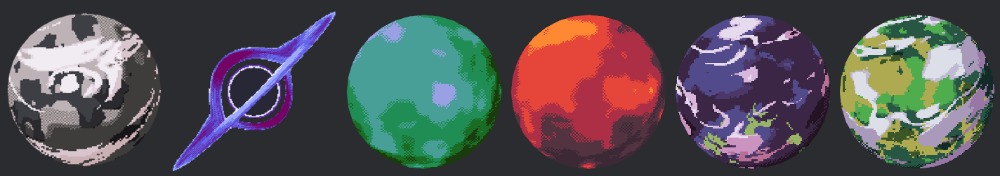

# pixel_planets_rs

A port of the amazing [PixelPlanets](https://github.com/Deep-Fold/PixelPlanets) by [Deep-Fold](https://github.com/Deep-Fold)

## Usage

The crate provides the `PixelPlanetsPlugin` plugin, which you should register as usual. After this planets are created by spawning an entity with the `XParams` component on it.
An observer watches for these components to be added and adds a `Mesh` and `Material`s so that the shader is rendered as expected. This was implemented using observers so that the user
does not need to worry about (or even know about) the different resources used to manage materials, which can be quite numerous.
 
## Samples

## Changes from the original

- Name changes that I may revert even though I like my names better
- The original uses `dith || !should_dither` in various places. I assumed that this was incorrect and have changed it to `dith && should_dither`
- Shaders have been ported from GDShader to WGSL. This required various changes like data being packed into a single uniform. A lot of the shader code has been refactored to use the lovely (if infuriating) `naga_oil` import capabilities

## Isn't there already a PixelPlanets Rust/Bevy port
I think there is but it didn't work for me on Bevy 0.18. 
Also I wanted to learn how to do shaders and make a better API for the plugin. 

## AI Declaration
Portions of the code in this repo were developed with assistance from LLMs. While none of the code was written by an LLM, it was used for debugging and some architectural decisions.
